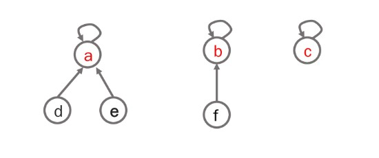

# 19th_study

### 19주차 알고리즘스터디

# 지난주 문제

<details>
<summary>접기/펼치기</summary>
<div markdown="1">

## [세로 읽기](https://www.codetree.ai/problems/vertical-reading/description)

### [민웅](./세로읽기/민웅.py)

```py
import sys
# input = sys.stdin.readline

word_lst = []
max_l = 0

for _ in range(4):
    tmp = list(input())
    if len(tmp) > max_l:
        max_l = len(tmp)
    word_lst.append(tmp)

# print(word_lst)
# print(max_l)

new_lst = [[-1]*max_l for _ in range(4)]
for i in range(4):
    for j in range(len(word_lst[i])):
        new_lst[i][j] = word_lst[i][j]

ans = ''

for i in range(max_l):
    for j in range(4):
        if new_lst[j][i] != -1:
            ans += str(new_lst[j][i])
print(ans)
```

### [상미](./세로읽기/상미.py)

```py

```

### [병국](./세로읽기/병국.py)

```py

```

### [성구](./세로읽기/성구.py)

```py
import sys
input = sys.stdin.readline


def solution(arr:list) -> str:
    ans = ""
    for j in range(max(map(lambda x:len(x), arr))):
        for i in range(4):
            if j >= len(arr[i]):
                continue
            ans += arr[i][j]
    return ans

if __name__ == "__main__":
    arr = [input().strip() for _ in range(4)]
    print(solution(arr))
```

### [승우](./세로읽기/승우.py)

```py

```

## [2배보다 커지는 수열](https://www.codetree.ai/training-field/search/problems/a-sequence-greater-than-twice/description?page=14&pageSize=20)

### [민웅](<./2배보다 커지는 수열/민웅.py>)

```py
import sys
input = sys.stdin.readline

N, M = map(int, input().split())

dp = [[0]*(M+1) for _ in range(N+1)]

for i in range(M+1):
    dp[1][i] = i

for i in range(2, N+1):
    tmp = 0
    for j in range(1, M+1):
        tmp += dp[i-1][j//2]
        dp[i][j] = (tmp%1000000007)

print(dp[-1][-1])

```

### [상미](<./2배보다 커지는 수열/상미.py>)

```py

```

### [병국](<./2배보다 커지는 수열/병국.py>)

```py

```

### [성구](<./2배보다 커지는 수열/성구.py>)

```py
# 2배보다 커지는 수열 
# 박영준 교수님의 힌트를 봤습니다
import sys
input = sys.stdin.readline

'''
0 1 2 3 4 5 6 7 8 9 10
0 1 0 0 0 0 0 0 0 0 0 
1 0 1 1 0 0 0 0 0 0 0
2 0 0 0 1 1 0 0 0 0 0
3 0 0 0 0 0 0 0 1 1 2
'''


def solution():
    n, m = map(int, input().split())
    dp = [[0] * (m+1) for i in range(1, n+1)]
    for i in range(1, m//2**(n-1)+1):
        dp[0][i] = 1
    for i in range(1, n):
        for j in range(2**(i), m//2**(n-i-1)+1):
            dp[i][j] += sum(dp[i-1][:j//2+1])

    print((sum(dp[n-1])) % 1_000_000_007)


if __name__ == "__main__":
    solution()
```

### [승우](<./2배보다 커지는 수열/승우.py>)

```py

```

## [코드트리 사내 메신저](https://www.codetree.ai/problems/codetree-internal-messenger/description)

### [민웅](<./코드트리 사내 메신저/민웅.py>)

```py
#3번 코드트리메신저
import sys
input = sys.stdin.readline

N = int(input())

def c_tree(n):
    if adjL[n]:
        child_lst = []
        for child in adjL[n]:
            c_time = c_tree(child)
            child_lst.append(c_time)
        child_lst.sort(reverse=True)

        max_child = 0
        for i in range(len(child_lst)):
            max_child = max((child_lst[i]+1)+i, max_child)
        return max_child
    else:
        return 0


employee_lst = list(map(int, input().split()))
adjL = [[] for _ in range(N + 1)]

for i in range(1, N):
    adjL[employee_lst[i]].append(i + 1)

print(c_tree(1))
```

### [상미](<./코드트리 사내 메신저/상미.py>)

```py

```

### [병국](<./코드트리 사내 메신저/병국.py>)

```py

```

### [성구](<./코드트리 사내 메신저/성구.py>)

```py

```

### [승우](<./코드트리 사내 메신저/승우.py>)

```py

```

<br/><br/>

</div>

</details>

</br></br>

# 이번주 문제

<details open>
<summary>접기/펼치기</summary>
<div markdown="1">

## [사이클 게임](https://www.acmicpc.net/problem/20040)

### [민웅](<./사이클 게임/민웅.py>)

```py
# 20040_사이클게임_cycle-game
import sys
input = sys.stdin.readline

N, M = map(int, input().split())

adjL = [[] for _ in range(N)]
parent = [i for i in range(N)]

def findset(i):
    while parent[i] != i:
        i = parent[i]
    return i

def union(x, y):
    parent[findset(y)] = findset(x)


ans = 0
for _ in range(M):
    s, g = map(int, input().split())
    ans += 1
    if findset(s) == findset(g):
        break
    union(s, g)
else:
    ans = 0

print(ans)
```

### [상미](<./사이클 게임/상미.py>)

```py

```

### [병국](<./사이클 게임/병국.py>)

```py

```

### [성구](<./사이클 게임/성구.py>)

```py
# 20040 사이클 게임
'''
- 반복문 find
    50548KB 552ms
- recursion find
    77844KB 700ms
'''
import sys
sys.setrecursionlimit(10**6)
input = sys.stdin.readline


def find(x:int):
    # 반복문 find 
    tmp = x
    while tmp != spots[tmp]:
        tmp = spots[tmp]
    spots[x] = spots[tmp]
    return spots[x]


def union(num1:int, num2:int):
    f1 = find(num1)
    f2 = find(num2)
    # 같으면 Circle
    # 이미 이어져 있는 간선은 같은 root를 가짐
    if f1 != f2:
        spots[f2] = f1
        return 0
    return 1


def solution(N:int, M:int) -> int:
    # 2개 간선은 Circle이 될 수 없음
    for _ in range(2):
        s, e = map(int, input().split())
        union(s, e)
    # 3개부터 Circle 체크
    for turn in range(3, M+1):
        s, e = map(int, input().split())
        # Circle이 되면 1 반환
        if union(s, e):
            return turn
    return 0


if __name__ == "__main__":
    N, M = map(int, input().split())
    spots = [i for i in range(N)] 
    print(solution(N, M))
```

### [승우](<./사이클 게임/승우.py>)

```py
import sys
# sys.stdin = open('input.txt', 'r')
input = sys.stdin.readline

n, m = map(int, input().split())

def findset(n):
    while parent[n] != n:
        n = parent[n]
    return n

def union(a, b):
    parent[findset(b)] = findset(a)


parent = [i for i in range(n)]
edge = [map(int,input().split()) for _ in range(m)]

answer = 0

for i in range(m):
    a, b = edge[i]
    if findset(a) == findset(b):
        answer = i + 1
        break
    union(a, b)

print(answer)

```

</div>
</details>
<br><br>

# 알고리즘 설명

<details>
<summary>접기/펼치기</summary>

## 용어 정리

### 상호베타 집합

- 정의 : 서로 중복으로 포함된 원소가 없는 집합, 즉 교집합이 없는 집합
- 상호배타 집합을 표현하는 방법으로는 연결리스트와 트리가 있다.

### 상호 배타 집합 표현 - 트리

- 하나의 집합을 하나의 트리로 표현
- 자식 노드가 부모 노드를 가리키며 루트 노드가 대표자가 된다.
  

### 상호배타 집합에 대한 연산

1. `FindSet(x)` : `x`를 포함하는 집합을 찾는 연산
   ```py
   def FindSet(x):
    while x != p[x]:
        x = p[x]
    return x
   ```
2. `Union(x, y)` : `x`와 `y`를 포함하는 두 집합을 통합하는 연산
   ```py
   def Union(x, y):
    p[FindSet(x)] = Findset(y)
   ```

</details>
